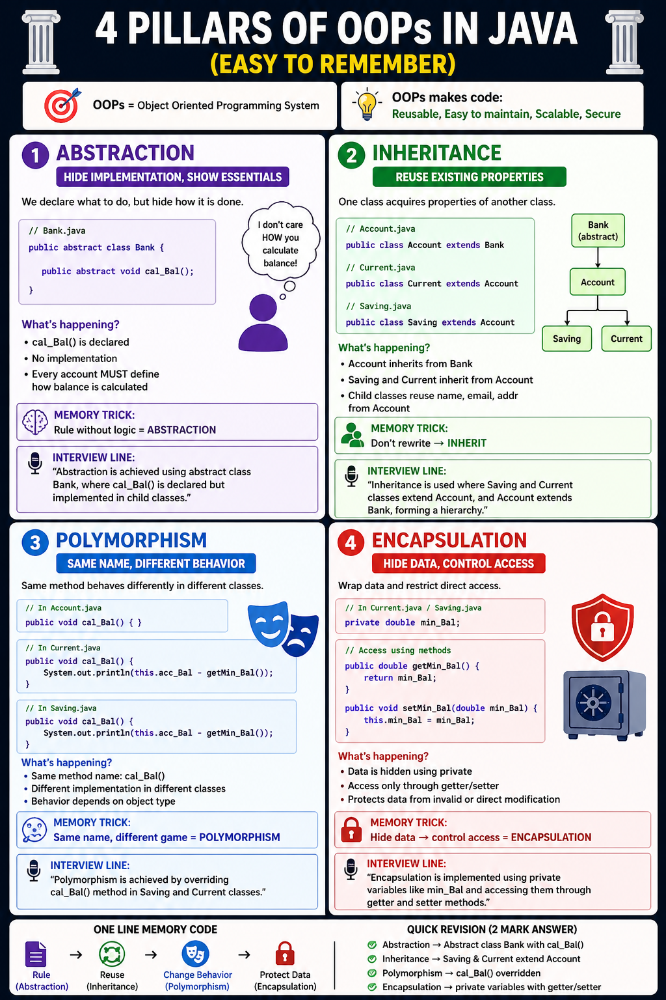

# 🧠 OOP Concepts in Java (4 - Pillars of Java)

---

# 🧠 1. ABSTRACTION (Most Important 🔥)

## ✅ Definition (Interview Ready)
Abstraction means hiding implementation and showing only essential details.

---

## 💻 In YOUR Code

👉 Look at your Bank class

```java
public abstract class Bank {
    public abstract void cal_Bal();
}
```

## 🔍 What’s happening?
### - cal_Bal() is declared
### - But no implementation

### 👉 This means:

### - "Every account MUST define how balance is calculated"

🧠 Simple Understanding

### - Bank says:

### - “I don’t care HOW you calculate balance”
#### - Child classes will decide

### -"Abstraction is achieved using abstract class Bank, where cal_Bal() is declared but implemented in child classes."

## 🧬 2. INHERITANCE

**✅ Definition**
Inheritance means one class acquiring properties of another class.

**💻 In YOUR Code**
👉 `Account` extends `Bank`:
```java
public class Account extends Bank {
    // ...
}
```
### ➡️ Saving and Current extend Acount

```java
public class Current extends Account {
    // ...
}
public class Saving extends Account {
    // ...
}
```
## 🔗 Structure

```
Bank (abstract)
   ↓
Account
   ↓
Saving     Current
```

**🧠 Simple Understanding**
** -Child classes reuse parent properties.**
** - Example: Saving & Current reuse Account details (name, email, addr).**

### "Inheritance is used where Saving and Current classes extend Account, and Account extends Bank, forming a hierarchy."

# 🔄 3. POLYMORPHISM
## Polymorphism means one method behaves differently in different classes 

## In Your Code 

### - same method : cal_Bal(){}

#### In Account

```java
public void cal_Bal(){}
```

#### In Current :

```java
public void cal_Bal(){
    System.out.println(this.acc_Bal - getMin_Bal());
}
```

#### In Saving : 

```java
public void cal_Bal(){
    System.out.println(this.acc_Bal - getMin_Bal());
}
```

## What is Happening ? 

### - Same method name → different implementation

## "Polymorphism is achieved by overriding cal_Bal() method in Saving and Current classes."

# 🔒 4. ENCAPSULATION

## - Encapsulation means wrapping data and restricting direct access using private variables.

# 💻 In YOUR Code

## 👉 Look at this:

```java
private double min_Bal;
```

```java
public double getMin_Bal()
public void setMin_Bal(double min_Bal)
```

## 🔍 What’s happening?
### Data is hidden (private)
### Access only through getter/setter

## "Protect data from direct access"

### "Encapsulation is implemented using private variables like min_Bal and accessing them through getter and setter methods."

| Concept       | Your Code                         |
| ------------- | --------------------------------- |
| Abstraction   | Bank (abstract class)             |
| Inheritance   | Account → Saving/Current          |
| Polymorphism  | cal_Bal() overridden              |
| Encapsulation | private min_Bal + getters/setters |

## - Abstraction → Abstract class Bank with cal_Bal()
## - Inheritance → Saving & Current extend Account
## - Polymorphism → cal_Bal() overridden
## - Encapsulation → private variables with getter/setter

